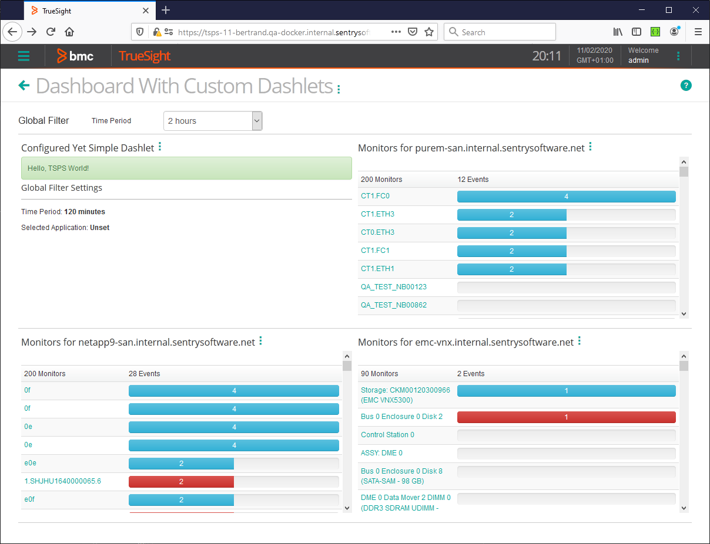
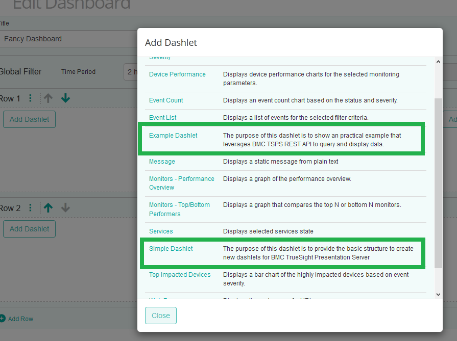
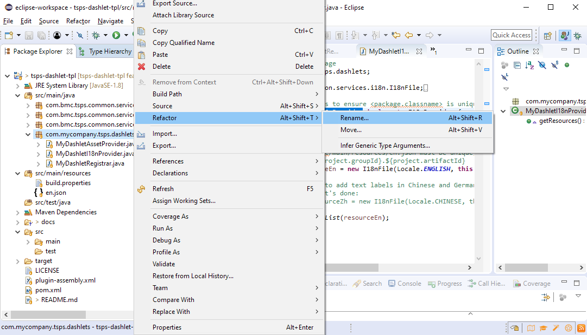
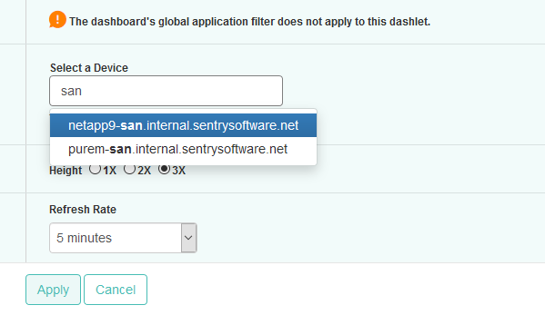

# Create New Dashlets for BMC TrueSight Presentation Server


A development guide showing how to create new *Dashlets* for the *Dashboards* in BMC TrueSight Presentation Server. This project builds:

* A `my-dashlets.zip` plugin for TSPS, containing:
  * The **Simple Dashlet**, which is a good start to create your own *dashlet*.
  * The **Example Dashlet**, which is a good example on how to leverage the TSPS REST API to extract data and then use AngularJS and the TSPS frontend framework to display this data.



## Prerequisites

This repository is a Maven project that builds a plugin for BMC TrueSight Presentation Server.
To build it successfully, you need the following items:

* [OpenJDK 8, 9, or higher](//jdk.java.net/)
* [Maven 3.x](//maven.apache.org/download.cgi)
* [BMC TrueSight Presentation Server](//www.bmc.com/it-solutions/truesight-operations-management.html) (obviously)
* A good Java editor (like [Eclipse](//www.eclipse.org/downloads/))
* A good text editor (like [Atom](//atom.io/) or [Visual Studio Code](//code.visualstudio.com/download))
* Expertise
  * [Java](//www.w3schools.com/JAVA/) `*----`
  * [Maven](//maven.apache.org/guides/getting-started/maven-in-five-minutes.html) `*----`
  * [JavaScript](//www.w3schools.com/js/) `***--`
  * [AngularJS](//www.w3schools.com/angular/) `****-`
  * [HTML](//www.w3schools.com/html/), [CSS](//www.w3schools.com/css/) `**---`

## How to Build

In the project root directory, simply run:

```sh
$ mvn clean package
```

This will build `target/my-dashlets-1.0.00-SNAPSHOT.zip`, which is the plugin to install in TSPS.

## How to Install

The first time, run the below command on the TSPS system, in the `/opt/bmc/TrueSightPServer/truesightpserver/bin` directory:

```sh
$ ./tssh componenttype add /tmp/my-dashlets-1.0.00-SNAPSHOT.zip
```

Once the plugin has been installed once, you will need to run the below command instead (`update` instead of `add`):

```sh
$ ./tssh componenttype update /tmp/my-dashlets-1.0.00-SNAPSHOT.zip
```

Note: The above examples assume the `target/my-dashlets-1.0.00-SNAPSHOT.zip` file has first been copied to `/tmp` on the TSPS system.

TSPS is automatically restarted. Refresh your browser after a minute and your new *Dashlets* are now listed as available when creating or editing a *Dashboard*! :-)



## The Internals

### The Build

This is a *Maven* project. If not familiar with *Maven*, we recommend [spending 5 minutes reading this](//maven.apache.org/guides/getting-started/maven-in-five-minutes.html), and maybe [some more time on this](//maven.apache.org/guides/getting-started/index.html).

The Java code (in `src/main/java`) is compiled and bundled together with the content of `src/main/webapp` to build a [.WAR](//en.wikipedia.org/wiki/WAR_%28file_format%29) file. This .WAR file is then packaged into a **.zip** file with the metadata necessary to declare a TSPS plugin.

The *Maven* filtering is enabled on all resources included in the **.war** file and in the plugin. Files in the package notably leverage the **pom.xml** coordinates to prevent any conflict with other plugins and dashlets that may be loaded in TSPS:

```xml
<artifactId>my-dashlets</artifactId>
<groupId>com.mycompany</groupId>
<version>1.0.00-SNAPSHOT</version>
```

These coordinates **MUST** be changed to something relevant to your project and organization.

### How Things Run in the Back

When the plugin is installed in TSPS, it is loaded upon startup. The **.war** file is loaded and the *MyDashletRegistrar.contextInitialized()* method (which extends *ServletContextListener*) is executed.

This registers *AssetProvider* and *I18nProvider* instances. The *MyDashletAssetProvider* class declares the **.js** and **.css** files in the `src/main/webapp` directory that need to be loaded in the user browser. The *MyDashletI18nProvider* class declares the `src/main/resources/en.json` files, which contains the text resources in English.

### How Things Run in the Front

When the browser loads the TSPS user interface, our **.js** and **.css** files get executed as well. The TSPS UI is developed with *AngularJS*. The Dashboards in TSPS are largely inspired from [Angular Dashboard Framework (adf)](//github.com/angular-dashboard-framework/angular-dashboard-framework).

Our **.js** code therefore needs to first declare an *AngularJS** module, and then declare our dashlets with *dashboardProvider*.

For each dashlet, we declare 2 [AngularJS Components](//docs.angularjs.org/guide/component) (because we're in 2020 after all):

* one that handles the configuration UI of the dashlet
* one that shows what the dashlet is supposed to show (based on its configuration)

Each *AngularJS Component* takes 2 attributes:

* **config** that contains the dashlet configuration object
* **dashlet** that contains the dashlet definition object (title, size and auto refresh rate)

## The Directories and Files in this Project

| File, Directory | Description |
|---|---|
| **pom.xml**    | Maven project settings   |
| **docs/**   | Documentation files  |
| **src/**   | Source files  |
| **src/main/java/**  | Java source files  |
| **src/main/java/com/bmc/**  | Minimal classes that emulate the TSPS Java internal API so that our own code compiles properly. The resulting **\*.class** files are excluded from the plugin  |
| **src/main/resources/en.json**  | Localized user-facing strings (English)  |
| **src/main/tsps-plugin/**  | Metadata required to build the TSPS plugin. **DO NOT MODIFY**  |
| **src/main/webapp/**  | Web front-end stuff, *AngularJS* module  |
| **target/**  | Maven build directory, where you'll find the plugin package  |
| **.classpath**, **.project**, **.settings/**  | Eclipse stuff. Keep it if you use Eclipse.  |
| **.github**, **.gitignore**  | Git stuff. Keep it if you use Git (and why whouldn't you?).  |
| **plugin-assembly.xml**  | Maven assembly descriptor for packaging the TSPS plugin. **DO NOT MODIFY**  |

## Where Do I Start?

### 1. Fork this Repository

First, you need to get the code.

Fork this repository (because you're not going to provide changes to **this** example, you'll develop your own stuff) and then clone it. If you're familiar with *Git* and *GitHub*, that will be easy enough. As this repository is marked as *Template*, you can use the [[Use this template]](generate) button.

Or you can simply download the source code from *GitHub* as an archive file that you uncompress on your system.

### 2. Modify the Project's Maven Coordinates

Modify **pom.xml** so that it reflects your project and organization (you're not working at *My Company*...):

```xml
<artifactId>my-dashlets</artifactId>
<groupId>com.mycompany</groupId>
<version>1.0.00-SNAPSHOT</version>
```

Note: The *1.0.00-SNAPSHOT* version format is [common practice in Maven](//maven.apache.org/guides/getting-started/index.html#What_is_a_SNAPSHOT_version). You can however use any version format if you do not plan *deploying* the Maven artifact to a Maven repository.

### 3. Refactor the Java Classes

The Java code that ships with this template is placed in the **com.mycompany.tsps.dashlets** package:

```java
package com.mycompany.tsps.dashlets;
```

The Java source files are logically placed in the **src/main/java/com/mycompany/tsps/dashlets/** directory.

You need to change the Java package **AND** the directory structure to reflect your own project and organization (again, you're probably not working at *My Company*...). All references to the package in the Java source files must be updated accordingly.

It is important to change the package to something unique, that will not conflict with other Java classes loaded by TSPS.

Note: The package name does not need to strictly match with the Maven **pom.xml** coordinates.

You can use Eclipse to rename the package, change the directory structure and update all references accordingly, in a single operation.



### 4. Build

You can build the project by executing this command in the root directory of the project:

```sh
$ mvn clean package
```

Errors will be displayed clearly in the output of the Maven command and need to be fixed to get the TSPS plugin.

### 5. Install

**Only once the refactoring has been done**, you can install the new TSPS plugin in your TSPS environment with the commands described in the above section.

## Working with the AngularJS Front-End

**Warning! This part requires the most expertise.**

Note: Whenever you rename, delete or add files in the front-end, make sure that your *AssetProvider* Java class declares all the **.js** and **.css** files properly. Missing a **.js** file there may be the cause of lengthy head-scratching sessions!

### Dashlets Registration

The *entry point* of our JavaScript code is **src/main/webapp/js/my-dashlets.js** (that you may rename to your liking).

This file declares our [AngularJS module](//docs.angularjs.org/guide/module), which depends on **adf.provider** (the Dashboard Framework).

Then, it declares our dashlet(s) to the [dashboardProvider](//angular-dashboard-framework.github.io/angular-dashboard-framework/docs/#/api/adf.dashboardProvider):

```js
// Register simpleDashlet
// TODO: Change the dashlet name
dashboardProvider.dashlet("simpleDashlet", {

  // Title and description below are references in src/main/resources/en.json
  title: "${project.groupId}.${project.artifactId}.simpleDashlet.title",
  description: "${project.groupId}.${project.artifactId}.simpleDashlet.description",

  // Dashlet definition
  height: "1X", // Will be overridden by dashlet user configuration
  template: "<dashlet-simple config='config' dashlet='model'></dashlet-simple>",
  disableManualRefresh : "true",
  edit: {
    template: "<dashlet-simple-edit config='config' dashlet='model'></dashlet-simple-edit>"
  },
  componentType: "TSPS"
});
```

A few comments:

* The dashlets **must** have a unique name to avoid conflicts with other existing dashlets.
* The title and description refer to localized strings declared in **src/main/resources/en.json**.
* The *template* fields are simple HTML fragment that leverage [AngularJS Components](//docs.angularjs.org/guide/component) that we detail below (`<dashlet-simple config='config' dashlet='model'></dashlet-simple>`).
* You can declare several dashlets.

### Dashlets Components

As we're in 2020, we decided to leverage [AngularJS Components](//docs.angularjs.org/guide/component) instead of [the traditional templates and controllers](//docs.angularjs.org/guide/concepts) that AngularJS developers are used to.

For each dashlet, we create 2 components. For example, for the *Simple Dashlet*, we have:

* `<dashlet-simple>`:
  * declared in **src/main/webapp/components/dashlet-simple/dashlet-simple.js**
  * actual *Dashlet* displayed as a part of a *Dashboard* in TSPS
* `<dashlet-simple-edit>`:
  * declared in **src/main/webapp/components/dashlet-simple/dashlet-simple-edit.js**
  * interface to configure the *Dashlet*

Both components have 2 attributes that are set at runtime and are available in both the **.js** and **.html** code as `$ctrl.config` and `$ctrl.dashlet`:

* *$ctrl.config*, an object that contains anything you decide to put in there as a developer:
  ```js
  config: {
    myCustomProperty1: 0,
    myCustomProperty2: "test",
    someArray: ["OK", "INFO", "SUCCESS"],
    subObject: {
      subProperty1: 30,
      subProperty2: "More"
    }
  }
  ```
* *$ctrl.dashlet*, an object that contains basic definition information of the *dashlet*:
  ```js
  dashlet: {
    height: "2X", // Can be "1X", "2X", "3X" or "4X"
    title: "My Customizable Title",
    refreshFactor: 2 // Controls the automatic refresh of the dashlet, in multiple of 30 seconds (here: 2 * 30s = 1 minute)
  }
  ```

The `<dashlet-simple-edit>` component sets the properties in `$ctrl.config` and `$ctrl.dashlet` according to what the user sets in the UI, while `<dashlet-simple-edit>` reads these objects to show the proper content in the *dashlet*.

The code for *Simple Dashlet* and *Example Dashlet* is heavily documented inline. Refer to the corresponding **.js** and **.html** files for more details about *dashlets* work.

### Typical Configuration Controls

The `<dashlet-simple-edit>` component shows how to let the user configure basic *dashlet* settings. The *JavaScript* part is minimal as most of the job is performed directly in the HTML template:

* Title
* Height
* Automatic Refresh


The `<dashlet-example-edit>` component shows how to implement more advanced stuff, like a text input that auto-fills with suggestions resulting from a REST API call (suggesting matching devices in this case).



Examine carefully the code of both components to understand how to implement something similar in your own *dashlets*!

### What Fancy Libraries Can I Use in Dashlets?

TrueSight Presentation Server already loads a bunch of *JavaScript* libraries, so we encourage you **NOT** to add more third-party libraries as it would make the overall front-end application even heavier than what it already is.

Libraries already present in TSPS:

* [AngularJS 1.6.6](//code.angularjs.org/1.6.6/docs/api)
  * Including [ngAnimate](//code.angularjs.org/1.6.6/docs/api/ngAnimate), [ngResource](//code.angularjs.org/1.6.6/docs/api/ngResource), [ngTouch](//code.angularjs.org/1.6.6/docs/api/ngTouch), [ngSanitize](//code.angularjs.org/1.6.6/docs/api/ngSanitize), [ngCookies](//code.angularjs.org/1.6.6/docs/api/ngCookies), [UI Router](//ui-router.github.io)
* [UI Bootstrap](//angular-ui.github.io/bootstrap/)
* [jQuery 1.12.2](//api.jquery.com/)
* [jQuery UI 1.11.2](//jqueryui.com/)
  * Including core.js, widget.js, mouse.js, position.js, accordion.js, autocomplete.js, button.js, datepicker.js, dialog.js, draggable.js, droppable.js, effect.js, effect-blind.js, effect-bounce.js, effect-clip.js, effect-drop.js, effect-explode.js, effect-fade.js, effect-fold.js, effect-highlight.js, effect-puff.js, effect-pulsate.js, effect-scale.js, effect-shake.js, effect-size.js, effect-slide.js, effect-transfer.js, menu.js, progressbar.js, resizable.js, selectable.js, selectmenu.js, slider.js, sortable.js, spinner.js, tabs.js, tooltip.js
* [AmCharts v3](//www.amcharts.com/docs/v3/)
  * Including [AmBalloon](//www.amcharts.com/docs/v3/reference/amballoon/), [AmChart](//www.amcharts.com/docs/v3/reference/amchart/), [AmCoordinateChart](//www.amcharts.com/docs/v3/reference/amcoordinatechart/), [AmGanttChart](//www.amcharts.com/docs/v3/reference/amganttchart/), [AmGraph](//www.amcharts.com/docs/v3/reference/amgraph/), [AmLegend](//www.amcharts.com/docs/v3/reference/amlegend/) (not [I Am Legend](//www.imdb.com/title/tt0480249/)), [AmPieChart](//www.amcharts.com/docs/v3/reference/ampiechart/), [AmRectangularChart](//www.amcharts.com/docs/v3/reference/amrectangularchart/), [AmSerialChart](//www.amcharts.com/docs/v3/reference/amserialchart/), [AmSlicedChart](//www.amcharts.com/docs/v3/reference/amslicedchart/), [AmStockChart](//www.amcharts.com/docs/v3/reference/amstockchart/), [AmXYChart](//www.amcharts.com/docs/v3/reference/amxychart/), AmChart theme `light`
* [FileSaver.js](https://github.com/eligrey/FileSaver.js)
* [PDF Make](//pdfmake.org/#/)
* [JSZip](//stuk.github.io/jszip/)
* [SheetJS](//github.com/SheetJS/sheetjs)
* [jqWidgets](http://jqwidgets.com/)
  * Including [jqxScrollBar](//www.jqwidgets.com/jquery-widgets-documentation/documentation/jqxscrollbar/jquery-scrollbar-getting-started.htm?search=jqxScrollBar), [jqxDataTable](//www.jqwidgets.com/jquery-widgets-documentation/documentation/jqxdatatable/jquery-datatable-getting-started.htm?search=jqxDataTable), [jqxCheckBox](//www.jqwidgets.com/jquery-widgets-documentation/documentation/jqxcheckandradio/jquery-checkbox-getting-started.htm?search=jqxCheckBox), [jqxGrid](//www.jqwidgets.com/jquery-widgets-documentation/documentation/jqxgrid/jquery-grid-getting-started.htm?search=jqxGrid), [jqxMenu](//www.jqwidgets.com/jquery-widgets-documentation/documentation/jqxmenu/jquery-menu-getting-started.htm?search=jqxMenu), [jqxTree](//www.jqwidgets.com/jquery-widgets-documentation/documentation/jqxtree/jquery-tree-getting-started.htm?search=jqxTree), [jqxListBox](//www.jqwidgets.com/jquery-widgets-documentation/documentation/jqxlistbox/jquery-listbox-getting-started.htm?search=jqxListBox), [jqxDropDownList](//www.jqwidgets.com/jquery-widgets-documentation/documentation/jqxdropdownlist/jquery-dropdownlist-getting-started.htm?search=jqxDropDownList), [jqxTreeGrid](//www.jqwidgets.com/jquery-widgets-documentation/documentation/jqxtreegrid/jquery-treegrid-getting-started.htm?search=jqxTreeGrid), [jqxComboBox](//www.jqwidgets.com/jquery-widgets-documentation/documentation/jqxcombobox/jquery-combobox-getting-started.htm?search=jqxComboBox), [jqxSlider](//www.jqwidgets.com/jquery-widgets-documentation/documentation/jqxslider/jquery-slider-getting-started.htm?search=jqxSlider), [jqxTooltip](//www.jqwidgets.com/jquery-widgets-documentation/documentation/jqxtooltip/jquery-tooltip-getting-started.htm?search=jqxTooltip), [jqxSplitter](//www.jqwidgets.com/jquery-widgets-documentation/documentation/jqxsplitter/jquery-splitter-getting-started.htm?search=jqxSplitter)
* [Moment.js](//momentjs.com/)

## Removing a TSPS Plugin

Uh ho... Looks like someone installed a bad plugin in their TSPS environment!

Unfortunately, the `tssh` command does not allow you to **remove** component types (plugins). So, you will need to go manual.

Assuming you want to uninstall the **my-dashlets** plugin (we told you not to install it!), execute these commands (Linux) in the TSPS home directory (typically **/opt/bmc/TrueSightPServer/truesightpserver/**):

```sh
$ rm -rf ./modules/tomcat/webapps/my-dashlets
$ rm ./modules/tomcat/webapps/my-dashlet.war
$ rm -rf ./modules/tomcat/work/Catalina/localhost/my-dashlet
$ rm -rf ./componenttypes/my-dashlet
$ rm -rf ./componenttypes/my-dashlet_*

```
